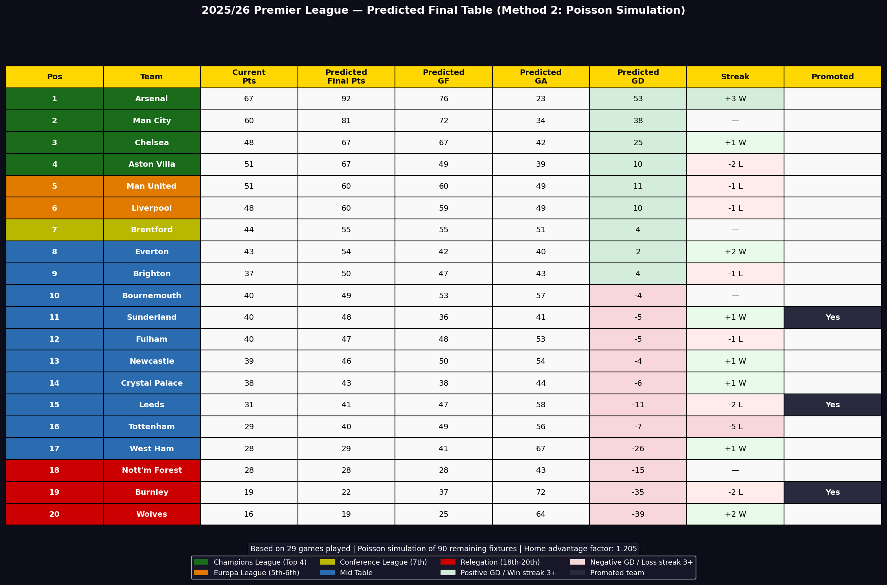
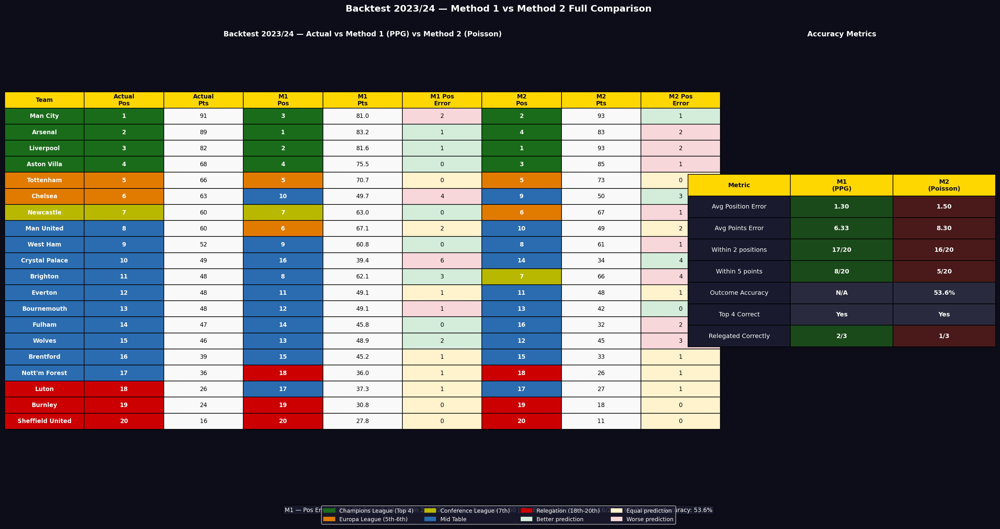
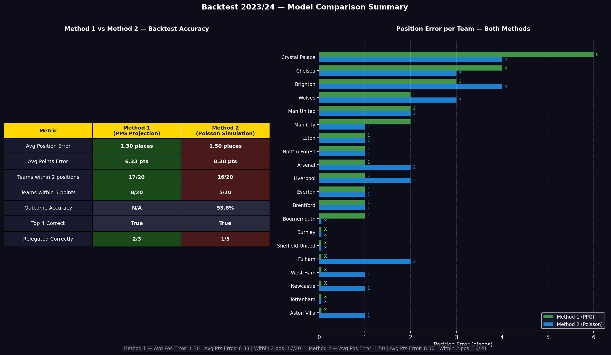
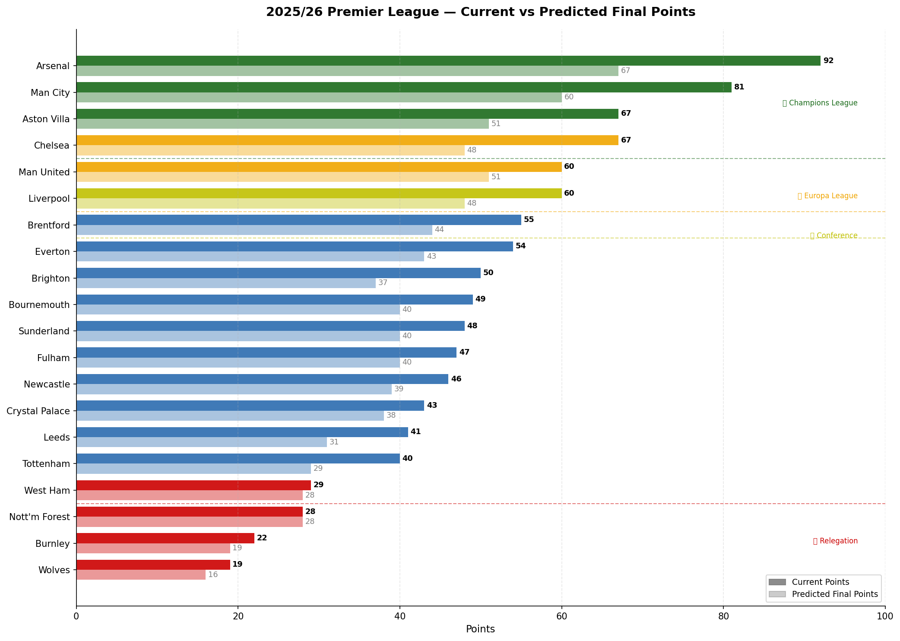

# Premier League 2025/26 Season Predictor

A data science project that predicts the final 2025/26 Premier League table 
using historical match data, current season form, and two independent 
predictive models. Built in collaboration with Claude (Anthropic) using 
AI-assisted development.

---

## Project Overview

With 29 matchweeks completed in the 2025/26 Premier League season, this 
project uses data from the current season, the last two full PL seasons, 
and Championship data for promoted clubs to forecast final standings.

The project addresses a key challenge most prediction models ignore — 
**newly promoted teams have no Premier League history**. To solve this, 
Championship data from the previous two seasons was integrated with a 
division adjustment factor to approximate how promoted teams are likely 
to perform at the top level.

Two independent models were built and validated against each other using 
a backtest on the 2023/24 season.

---

## Data Sources

| File | Description |
|---|---|
| `PremierLeague.csv` | Historical PL match data (1993–2025) |
| `premier_league_2526.csv` | Live 2025/26 match results |
| `championship_2223.csv` | Championship 2022/23 season |
| `championship_2324.csv` | Championship 2023/24 season |
| `2024-2025 fixtures.csv` | 2024/25 fixture list |

---

## Promoted Teams (2025/26)

| Team | Championship Season Used |
|---|---|
| Burnley | 2023/24 |
| Leeds United | 2023/24 |
| Sunderland | 2023/24 |

Championship stats were adjusted using a division drop-off factor:
- Goals scored × 0.80
- Goals conceded × 1.15
- Win rate × 0.75

---

## Models

### Method 1 — Blended PPG Projection
Projects final points by blending each team's current season 
points per game with their historical average from the last 
two seasons. The blend weight scales dynamically as the season 
progresses — the more games played, the more the model trusts 
current form over history.

A streak momentum bonus is applied: each game of a winning 
streak adds +0.03 PPG, each game of a losing streak subtracts 
-0.03 PPG.

**Formula:**
```
projected_points = current_points + (blended_ppg × games_remaining)
blended_ppg = (current_ppg × current_weight) + (hist_ppg × hist_weight)
```

### Method 2 — Poisson Distribution Match Simulator
Simulates every remaining fixture individually using the Poisson 
distribution. For each match, expected goals are calculated from 
each team's attack strength vs the opponent's defense strength, 
adjusted for home advantage.

The most probable scoreline from all possible 0–7 scorelines is 
selected, points are awarded and the table is updated iteratively 
until all remaining games are simulated.

**Formula:**
```
home_expected_goals = home_attack × away_defense × league_avg × home_advantage
away_expected_goals = away_attack × home_defense × league_avg
```

---

## Backtest Results (2023/24)

Trained on the first 19 matchweeks of 2023/24, predicted the 
remaining 19 matchweeks, compared to actual final standings.

| Metric | Method 1 (PPG) | Method 2 (Poisson) |
|---|---|---|
| Avg Position Error | 1.30 places | 1.50 places |
| Avg Points Error | 6.33 pts | 8.30 pts |
| Teams within 2 positions | 17/20 | 16/20 |
| Teams within 5 points | 8/20 | 5/20 |
| Outcome Accuracy | N/A | 53.6% |
| Top 4 Correct | Yes | Yes |
| Relegated Correctly | 2/3 | 1/3 |

**Key finding:** Method 1 outperforms Method 2 on table prediction 
accuracy. Method 2's advantage is outcome accuracy — it predicts 
individual match results at 53.6%, well above the 33% random baseline.

---

## Predicted Final Table 2025/26




---

## Backtest Visualizations





---

## Current vs Predicted Points



---

## Tools & Libraries

- **Python** — core language
- **Pandas** — data cleaning and manipulation
- **NumPy** — numerical operations
- **SciPy** — Poisson distribution modelling
- **Matplotlib** — all visualizations
- **Google Colab** — development environment

---

## Limitations

- Poisson model does not account for injuries, suspensions or 
  managerial changes mid-season
- Championship adjustment factor is estimated — the exact 
  performance drop-off varies by team
- Model accuracy improves as more games are played and current 
  form becomes a stronger signal
- Fixture list for remaining games was compiled manually

---

## Acknowledgements

Built in collaboration with **Claude by Anthropic** using 
AI-assisted development. Project scoping, dataset sourcing, 
domain knowledge and model design decisions by the author.

---

## Author

Connect with me on [LinkedIn](#) www.linkedin.com/in/maximus-maurice-okite-6b39ab297


```

---

### **LinkedIn Description**
```
Premier League 2025/26 Season Predictor

Built an end-to-end predictive model for the 2025/26 Premier League 
season using Python.

Integrated 5 datasets across 3 seasons including Championship data 
for promoted clubs, engineered features including goals, form, streaks 
and attack/defense strength ratings, and implemented two independent 
models — a Blended PPG Projection and a Poisson Distribution Match 
Simulator — to forecast the final standings.

Backtested against the 2023/24 season achieving 53.6% match outcome 
accuracy and 1.50 average position error with the Poisson model, and 
1.30 average position error with the PPG model.

Key personal contributions: project scoping, dataset sourcing, domain 
knowledge of football analytics, model design decisions and iterative 
direction throughout development.

Skills: Python · Pandas · NumPy · SciPy · Matplotlib · Data Cleaning · 
Feature Engineering · Poisson Statistical Modelling · Predictive 
Analytics · Model Backtesting · AI-Assisted Development
